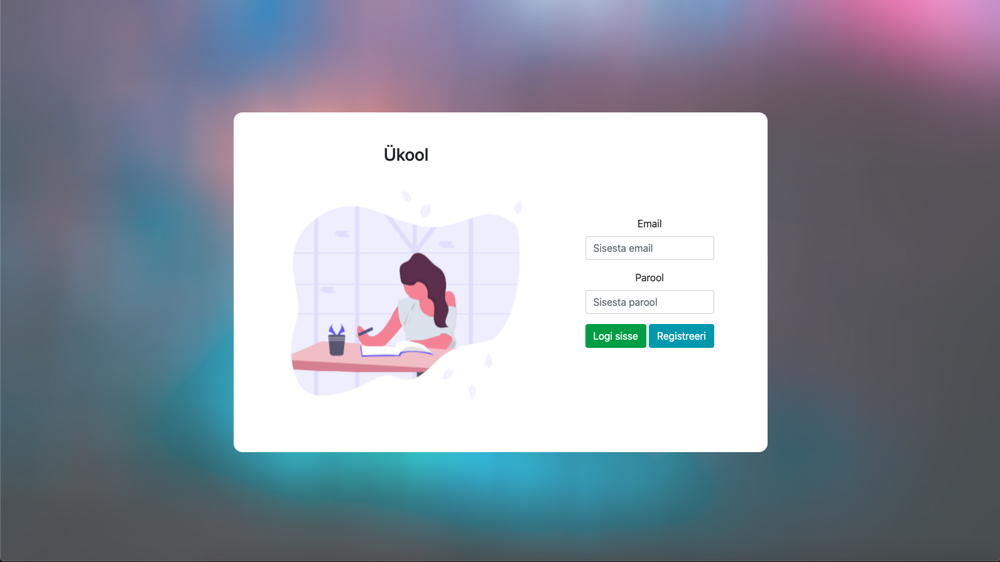
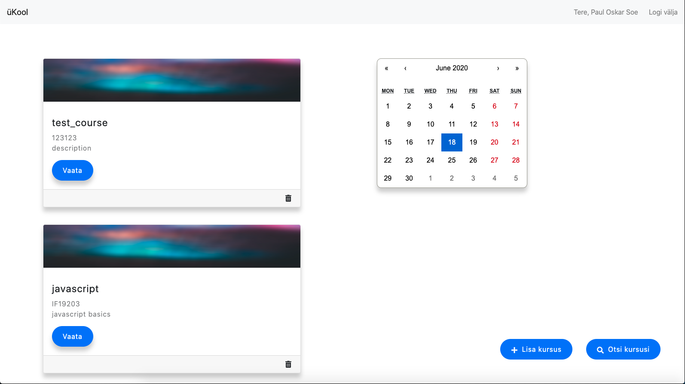

# üKool

## Eesmärk ja lühikirjeldus

Ü-Kool on veebikeskkond, kus tuuakse kokku üliõpilane ja tema õppejõud. Õppejõul on võimalik kõik enda edasiantav informatsioon laadida üles veebikeskkonda, näiteks kodusedtööd, mis on ideaalne lahendus üliõpilasele, kes soovib hoida pidevalt silma peal kogul toimuval õppetööl. Projekti eesmärgiks on elimineerida kodutööde kohta käiva informatsiooni kadu. üKooli puhul on tegemist võit-võit situatsiooniga, kus üliõpilane teab mida ta tegema peab ning õppejõud näeb seda, kas tudengil on kodutöö tehtud või mitte.

## Tiimiliikmed

- Paul Oskar Soe
- Karl-Markus Pihlakas
- Tauri Miilits
- Daniel Gurevitš

## Ekraanipildid





## Testimise dokumentatsioon

### Kasutaja loomine ja autoriseerimine

| Testi lugu        | Ootatud tulemus          | Tegelik tulemus  | Kas läbis  |
| ------------- |:-------------:| -----:| -----:|
| Kasutaja loomine html input väärtustega      | html input väärtustega luuakse andmebaasi kasutaja | html input väärtustega luuakse andmebaasi kasutaja | jah |
| Parooli hashimine      | parooli tekst hashitakse pikaks stringiks      |   parooli tekst hashitakse pikaks stringiks | jah |
| Kasutaja sisselogimine õigete input väärtustel | Kasutaja logitakse sisse      |   Kasutaja logitakse sisse | jah | 
| Sisselogimise input väljade valideerimine, kui puudub väärtus väljale, siis kuvatakse error message | Saadeti error message, et vajalik väli on puudu      |   Saadeti error message, et vajalik väli on puudu | jah |
| Sisselogimise inputid valideeritakse serveris, kui on puudulik välja siis API tagastab, et väljad on puudu | API saadab errori, et väljad on puudu staatus koodiga 401(unauthorized)      |   API saadab errori, et väljad on puudu staatus koodiga 401(unauthorized) | jah |

### Kursuse lisamine/ eemaldamine/ kursuse otsimine/ kursusele registreerimine ning kasutaja kursuste kuvamine


| Testi lugu        | Ootatud tulemus          | Tegelik tulemus  | Kas läbis  |
| ------------- |:-------------:| -----:| -----:|
| Kursuse loomine html input väärtustega ning frontend ja backend valideerimine on kasutaja on õpetaja     | edukas kursuse lisamine input väärtuste alusel, kui kasutaja on õpetaja | edukas kursuse lisamine input väärtuste alusel, kui kasutaja on õpetaja  | jah |
| Kursuse eemaldamine ning valideerimine, et eemaldaja on õpetaja      | kursus eemaldatakse      |   kursus eemaldatakse| jah |
| Kasutaja poolt sisestatud stringiga tehakse andmebaasi päring, mis tagastab kõik kursused vastava väärtusega | Tagastatakse vastavad kursused      |  Tagastatakse vastavad kursused | jah | 
| Tudeng saab saata kursusele registreerimiskutse, mida pärast ainult näeb õppejõud ja õppejõud saab võtta tudengi kursusele vastu või siis selle kutse kustutada | Registreerimiskutse saatmine on edukas ning õppejõud näeb kutset mida saab aksepteerida või kustutada      |   Registreerimiskutse saatmine on edukas ning õppejõud näeb kutset mida saab aksepteerida või kustutada | jah |
| Kuvatakse kõik kasutaja kursused sisselogimisel | Kuvatakse kasutaja kursused      |  Kuvatakse kasutaja kursused | jah |


### Koduse ülesande lisamine ning ülesannete kuvamine kursuse kaupa 


| Testi lugu        | Ootatud tulemus          | Tegelik tulemus  | Kas läbis  |
| ------------- |:-------------:| -----:| -----:|
| Õpetaja lisab koduse ülesande      | Kodune ülesanne salvestatakse andmebaasi | Kodune ülesanne salvestatakse andmebaasi | jah |
| Tudeng näeb listatud kodust ülesannet      | Tudeng näeb esitatud kodust ülesannet      |   Tudeng näeb esitatud kodust ülesannet | jah |


### Koduse ülesande lahenduse lisamine ning kuvamine  

| Testi lugu        | Ootatud tulemus          | Tegelik tulemus  | Kas läbis  |
| ------------- |:-------------:| -----:| -----:|
| Tudeng saab lisada ülesandele lahenduse      | Lahendus salvestatakse andmebaasi vastavale kursusele | Lahendus salvestatakse andmebaasi vastavale kursusele | jah |
| Õpetaja näeb tudengi poolt esitatud kodutöö lahendust      | Lahendused ülesande kaupa kuvatakse ülesande juurde      |   ülesande lahendusi ei kuvata | ei |
| Õpetaja saab aktsepteerida esitatud kodutöid | Andmebaasi salvestatakse, et lahendus on aktsepteeritud      |  Andmebaasi ei tehta päringut | ei | 


## Kasutatud tehnoloogiad ja nende versioonid

- MonoDB
- expressJS
- ReactJS
- NodeJS
- Javascript
- CSS

## Kasutatud serveri andmed

## Paigaldusjuhised

[Node installeerimine](https://nodejs.org/en/download/)
[Yarni installeerimine](https://classic.yarnpkg.com/en/docs/install/)

### Moodulite alla laadimine ja koodi käivitumine:

### API käivitumines

```
cd api
npm install
npm start
```

### Kliendi poole käivitumine

```
cd client
npm install
npm start
```

## Litsents

Antud projektil on MIT litsents - vaata [LICENSE](LICENSE) faili täpsema info jaoks.
